# 🎓 Graduation Project: Nabd Space
## Employee Mental Health & Well-being Management System
### Bachelor of Information Technology — Systems Development and Administration

---

## 📋 Table of Contents
1. [Project Idea](#-project-idea)
2. [Problem & Solution](#-problem--solution)
3. [Key Features](#-key-features)
4. [Target Audience](#-target-audience)
5. [Tech Stack](#-tech-stack)
6. [Architecture](#-architecture)
7. [Database Schema](#-database-schema)
8. [Pages & Routes](#-pages--routes)
9. [User Roles](#-user-roles)
10. [User Flow](#-user-flow)
11. [Screenshots](#-screenshots)
12. [How to Run the Project](#-how-to-run-the-project)
13. [Future Work](#-future-work)
14. [Team](#-team)
15. [Appendix: Full Folder Structure](#-appendix-full-folder-structure)

---

## 💡 Project Idea

**Nabd** (meaning "Pulse" in Arabic) is a comprehensive web application for managing employee mental health and well-being within companies and organizations. It aims to **care for employee morale** through:

- 📊 **Daily Pulse Check-in** — A simple daily mood/sentiment measurement
- 🤝 **Supportive Follow-up** — Non-stigmatizing follow-up for critical cases
- ⭐ **Points & Rewards** — Gamified incentive system to encourage participation
- 🧘 **Session Booking** — Book relaxation sessions (yoga, group breathing)
- 📈 **Analytics & Reports** — Data-driven insights for management

> **Tagline**: *"Caring for employee morale — with calm and attention."*

---

## 🔍 Problem & Solution

### The Problem:
- **70%** of employees experience work-related burnout
- Weak communication between management and employees regarding mental health
- Lack of digital tools for regular morale monitoring
- Social stigma associated with seeking psychological support

### The Solution — Nabd Space:
- Simple daily measurement **without pressure**
- **Supportive & encouraging language** instead of alarming terminology
- **Rewards & gamification** to motivate consistency
- **Complete privacy** — employees only see their own data
- **Integrated admin dashboard** for team monitoring

---

## ✨ Key Features

### 👤 Employee Dashboard
| Feature | Description |
|---------|-------------|
| **Daily Mood Check-in** | 5 simple questions about energy, stress, focus, support, mood |
| **Points System** | Earn 25 points daily for completing the mood check-in |
| **Rewards & Badges** | Unlock badges at 300, 400, 500 points thresholds |
| **Session Booking** | Book yoga & meditation sessions with live seat availability |
| **Notifications** | Instant notifications for points earned, rewards unlocked, upcoming sessions |

### 👑 Admin Dashboard
| Feature | Description |
|---------|-------------|
| **Participation Rate** | Track how many employees completed their daily check-in |
| **Total Points Distributed** | Measure employee engagement & interaction |
| **Follow-up Cases** | Critical alerts requiring gentle intervention |
| **Reports** | Weekly/Monthly/Yearly reports with PDF & CSV export |
| **Analytics** | Interactive charts (Line, Bar, Pie) for department comparison |
| **File Upload** | Bulk employee data upload via CSV |

---

## 🎯 Target Audience

- **Tech companies & organizations** with 10+ employees
- **HR Departments** responsible for employee well-being
- **Employees** seeking daily mental health support & self-care tools

---

## 🛠 Tech Stack

### Frontend
| Technology | Version | Usage |
|------------|---------|-------|
| React | 18.3.1 | UI Component Library |
| TypeScript | 5.5.2 | Type Safety & Developer Experience |
| Vite | 5.3.1 | Build Tool & Dev Server |
| TailwindCSS | 3.4.4 | Utility-first CSS Styling |
| React Router | 7.18.1 | Client-side Routing |
| Recharts | 2.12.7 | Data Visualization (Charts) |
| Lucide React | 0.400.0 | Icon Library |

### Backend / Database
| Technology | Usage |
|------------|-------|
| **Supabase** | PostgreSQL Database + Auth + File Storage |
| **Supabase Auth** | Authentication & Session Management |
| **Row Level Security (RLS)** | Row-level database permissions |

### Data Layer Strategy
| Type | Description |
|------|-------------|
| **Mock Data** | Built-in dummy data (default) — **No Backend Required** |
| **Supabase** | Real database when environment variables are configured |
| **Local Storage** | Session persistence for local preview |

### Additional
| Feature | Description |
|---------|-------------|
| **RTL/LTR** | Full Arabic (Right-to-Left) & English support |
| **Dark Theme** | Elegant dark UI with lavender & pink color palette |
| **Responsive** | Fully responsive across all screen sizes |

---

## 🏗 Architecture

```
nabd-hr-admin/
├── src/
│   ├── main.tsx              # Entry point — Boot + Language Provider
│   ├── App.tsx               # Router configuration
│   ├── index.css             # TailwindCSS base styles
│   │
│   ├── theme/
│   │   └── tokens.ts         # Centralized design tokens (colors)
│   │
│   ├── auth/
│   │   ├── BootContext.tsx    # Auth context provider (session check)
│   │   └── ProtectedRoute.tsx # Role-based route protection
│   │
│   ├── components/
│   │   ├── ui/               # Reusable UI primitives (Button, Card, Input...)
│   │   ├── AppShell.tsx      # Post-login layout shell
│   │   ├── AdminUI.tsx       # Admin-specific components
│   │   ├── LangToggle.tsx    # Language switcher
│   │   ├── HeartLoader.tsx   # Animated heartbeat loading screen
│   │   └── DataState.tsx     # Loading/Empty/Data state manager
│   │
│   ├── i18n/
│   │   ├── i18n.ts           # Translation dictionary (AR/EN)
│   │   └── LangContext.tsx    # Language context provider
│   │
│   ├── lib/
│   │   ├── supabaseClient.ts # Supabase client connection
│   │   └── dashboardData.ts  # Business logic layer
│   │
│   ├── mock-data/            # Mock data per entity
│   ├── pages/                # All application pages
│   └── styles/
│       └── fonts.css         # Arabic & English fonts
│
├── supabase/
│   └── migrations/
│       └── 001_init_hr_schema.sql # Database schema migration
│
└── Configuration files (package.json, tsconfig, vite.config, tailwind...)
```

### Architecture Pattern

```
┌─────────────────────────────────────────────────┐
│                   Browser                       │
│  ┌──────────┐  ┌──────────┐  ┌──────────┐      │
│  │   Pages  │  │ Components│  │   Auth   │      │
│  └────┬─────┘  └────┬─────┘  └────┬─────┘      │
│       │             │             │             │
│  ┌────▼─────────────▼─────────────▼────────┐    │
│  │           Business Logic                │    │
│  │        (dashboardData.ts)               │    │
│  └────────────────┬────────────────────────┘    │
│                   │                             │
│  ┌────────────────▼────────────────────────┐    │
│  │           Data Layer                    │    │
│  │  ┌─────────────┐  ┌────────────────┐   │    │
│  │  │  Mock Data  │  │  Supabase DB   │   │    │
│  │  │  (Built-in) │  │  (Optional)    │   │    │
│  │  └─────────────┘  └────────────────┘   │    │
│  └─────────────────────────────────────────┘    │
└──────────────────────────────────────────────────┘
```

**Key Design Decision**: The system works **fully without a Backend** — it uses built-in Mock Data by default. When Supabase environment variables are provided, it automatically switches to the real database. This makes it immediately demonstrable and testable.

---

## 🗄 Database Schema

### Users Table
```sql
create table users (
  id uuid primary key references auth.users(id),
  full_name text not null,
  email text unique not null,
  role text not null check (role in ('admin','employee')),
  department text,
  employee_number text unique
);
```

### Pulse Questions Table
```sql
create table pulse_questions (
  id bigserial primary key,
  question_key text unique not null,
  question_text text not null,
  is_active boolean default true
);
```

### Pulse Responses Table
```sql
create table pulse_responses (
  id bigserial primary key,
  user_id uuid references users(id),
  pulse_question_id bigint references pulse_questions(id),
  response_value integer,
  created_at timestamptz default now()
);
```

### Points Ledger Table
```sql
create table points_ledger (
  id bigserial primary key,
  user_id uuid references users(id),
  points_delta integer not null,
  reason text,
  created_at timestamptz default now()
);
```

### Rewards Tables
```sql
create table rewards (
  id bigserial primary key,
  title text not null,
  points_cost integer not null,
  is_active boolean default true
);

create table user_rewards (
  id bigserial primary key,
  user_id uuid references users(id),
  reward_id bigint references rewards(id),
  status text default 'pending',
  unique(user_id, reward_id)
);
```

### Sessions Tables
```sql
create table yoga_sessions (
  id bigserial primary key,
  title text not null,
  mode text, coach text,
  starts_at timestamptz not null,
  capacity integer default 1,
  is_active boolean default true
);

create table session_attendance (
  id bigserial primary key,
  user_id uuid references users(id),
  session_id bigint references yoga_sessions(id),
  status text default 'registered',
  unique(user_id, session_id)
);
```

### Notifications Tables
```sql
create table notifications (
  id bigserial primary key,
  user_id uuid references users(id),
  type text not null,
  title text not null,
  body text,
  is_read boolean default false
);

create table critical_alerts (
  id bigserial primary key,
  user_id uuid references users(id),
  level text default 'non_blocking',
  message text not null,
  is_resolved boolean default false
);
```

### Security: Row Level Security (RLS)

The system uses Supabase's **Row Level Security** to ensure:
- 🔒 **Employees**: Can only see their own data (points, responses, notifications)
- 👑 **Admins**: Can see all data + manage sessions & uploads
- ✅ Every table has dedicated policies for granular access control

---

## 🖥 Pages & Routes

### Public Routes (No Authentication Required)
| Route | Page | Description |
|-------|------|-------------|
| `/` | Landing Page | Marketing & introduction page |
| `/login` | Login | Authentication (demo: emp1/1234, admin/1234) |
| `/signup` | Signup | New account creation |

### Protected Routes — Employee Role
| Route | Page | Description |
|-------|------|-------------|
| `/employee` | Employee Dashboard | Main employee overview |
| `/mood` | Mood Questions | Daily 5-question mood check-in |
| `/points` | Points & Rewards | Points balance, ledger, badges |
| `/sessions` | Sessions Calendar | Session booking & calendar |
| `/notifications` | Notifications | In-app notification feed |

### Protected Routes — Admin Role
| Route | Page | Description |
|-------|------|-------------|
| `/admin` | Admin Dashboard | Main admin KPIs |
| `/upload` | Upload Files | CSV employee data upload |
| `/reports` | Reports | Reports with PDF/CSV export |
| `/sessions` | Sessions Calendar | Manage sessions + booking |
| `/analytics` | Analytics | Charts & data visualization |
| `/analytics-2` | Compare | Department comparison |
| `/notifications` | Notifications | Manage notifications |

---

## 👥 User Roles

### 1. Employee Role
- **Demo Credentials**: `emp1` / `1234`
- **Permissions**:
  - Complete daily mood check-in (once per day — duplicate prevention)
  - View points balance, transaction history & rewards
  - Book available sessions (with real-time capacity check)
  - View personal notifications only

### 2. Admin Role
- **Demo Credentials**: `admin` / `1234`
- **Permissions**:
  - Dashboard with KPIs (participation rate, points, follow-up cases)
  - Detailed reports with PDF/CSV export (weekly/monthly/yearly)
  - Interactive analytics with Line, Bar, and Pie charts
  - Add new yoga/meditation sessions
  - Upload employee CSV files
  - View all data across the organization

---

## 🔄 User Flow

### 📌 Employee Flow
```
Landing Page → Login (emp1/1234) → Employee Dashboard
                                             │
          ┌──────────────────────────────────┼─────────────────────────────┐
          ▼                                  ▼                             ▼
    Daily Mood Check-in               Points & Rewards             Book a Session
          │                                  │                             │
          ▼                                  ▼                             ▼
  Answers 5 questions ←    Checks current     Checks points &    Selects a session
  Earns 25 points ✓       mood status ✓       badges progress ✓   Books ✓
```

### 📌 Admin Flow
```
Landing Page → Login (admin/1234) → Admin Dashboard
                                             │
          ┌──────────────────────────────────┼─────────────────────────────┐
          ▼                                  ▼                             ▼
       KPI Dashboard                   Reports                    Analytics
          │                                  │                             │
          ▼                                  ▼                             ▼
  Participation rate ←        Changes period           Views charts        Add sessions
  Total points            (weekly/monthly/yearly)     (Line, Bar, Pie)     Upload files
  Follow-up cases          Exports PDF or CSV
```

---

## 📸 System Screenshots

> The following screenshots were captured directly from the running application. All pages use **mock data** and are fully interactive without any backend setup.

---

### 1. Landing Page 🏠
The marketing homepage featuring the Nabd heart logo, a brief description, and action buttons for Login / Signup. It also displays feature cards (Daily Pulse, Supportive Follow-up, Rewards) and a roles section for Employee / Admin.

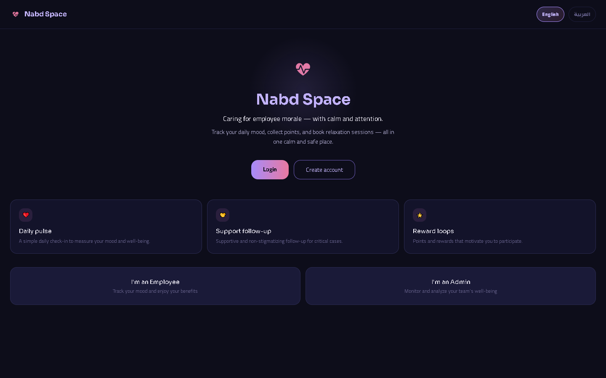

---

### 2. Login Page 🔐
Authentication page with a role toggle (Employee / Admin). Users can log in with demo credentials (`emp1/1234` for employee, `admin/1234` for admin) or via Supabase Auth when configured.

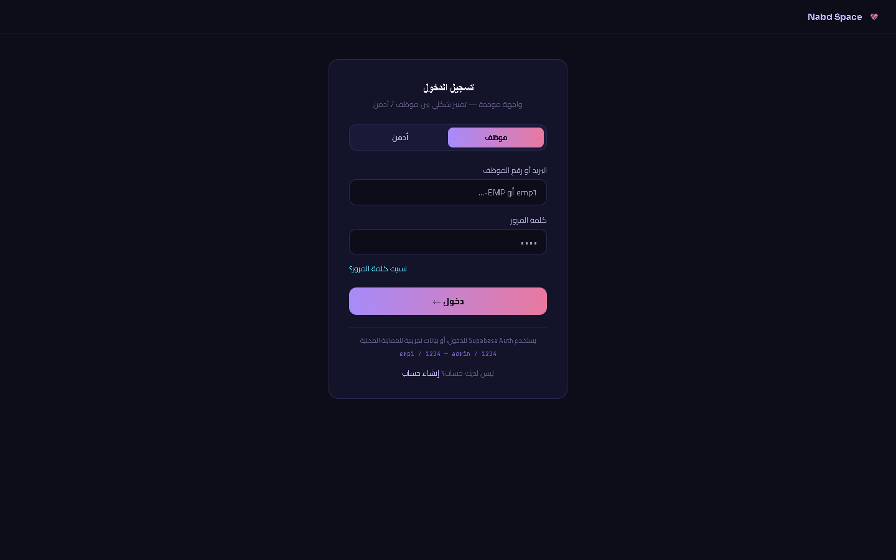

---

### 3. Employee Dashboard 👤
The main employee overview showing:
- **Morale Status**: Daily completion percentage with a supportive status label
- **Points Balance**: Progress bar with current balance and next threshold
- **Upcoming Sessions**: Session cards with direct booking
- **Latest Notifications**: Notification feed

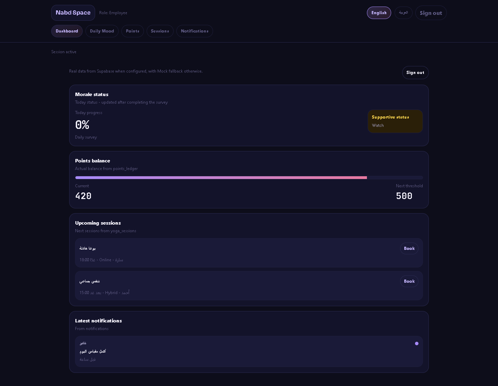

---

### 4. Mood Check-in (Daily Pulse) 📝
5 simple questions about energy, stress, focus, support, and mood with a 1–5 rating scale. Includes a progress bar, 25-point reward on completion, and duplicate prevention (once per day).

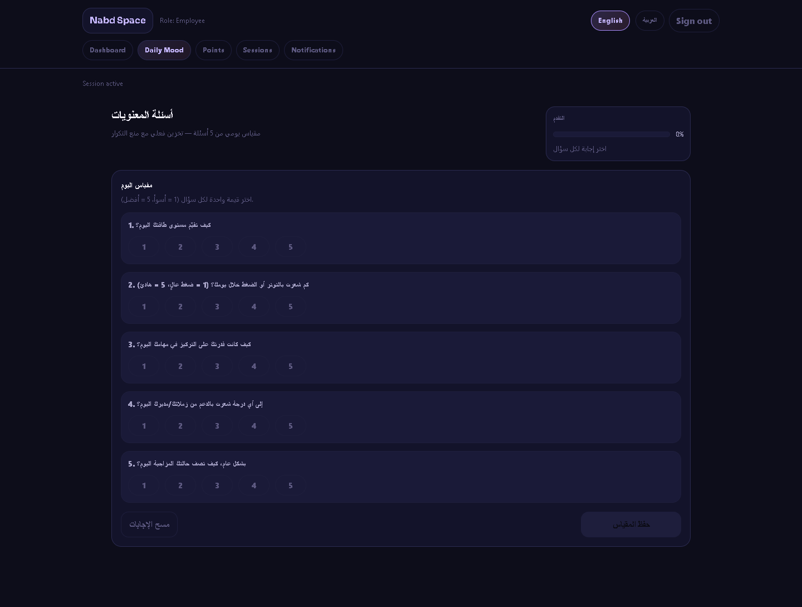

---

### 5. Points & Rewards ⭐
Shows the progress bar (current balance vs. 500-point threshold), transaction ledger with timestamps, and badge rewards unlocked at 300, 400, and 500 points.

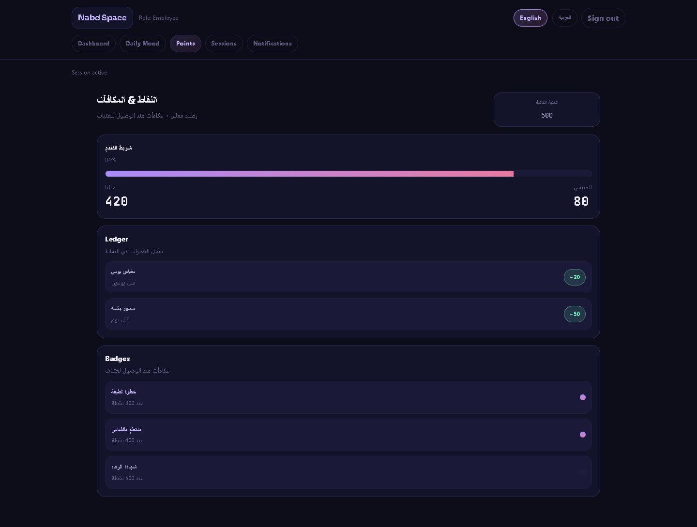

---

### 6. Sessions Calendar 📅
Lists available yoga/meditation sessions with details (title, time, coach, available seats). Employees can book directly; admins can add new sessions via a form.

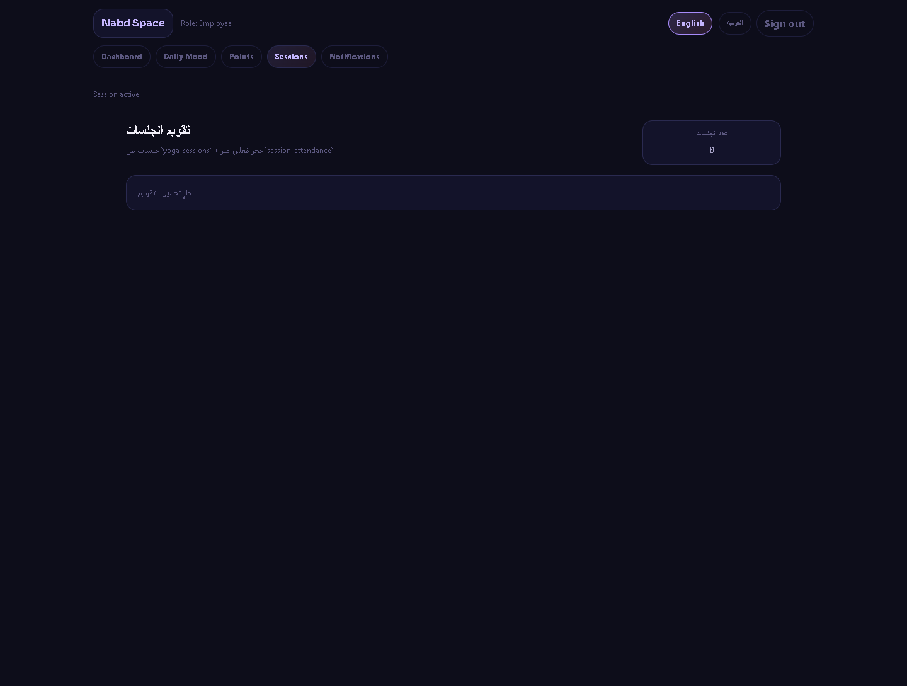

---

### 7. Notifications 🔔
In-app notification feed showing system alerts (reminders, session bookings, rewards unlocked) with read/unread status.

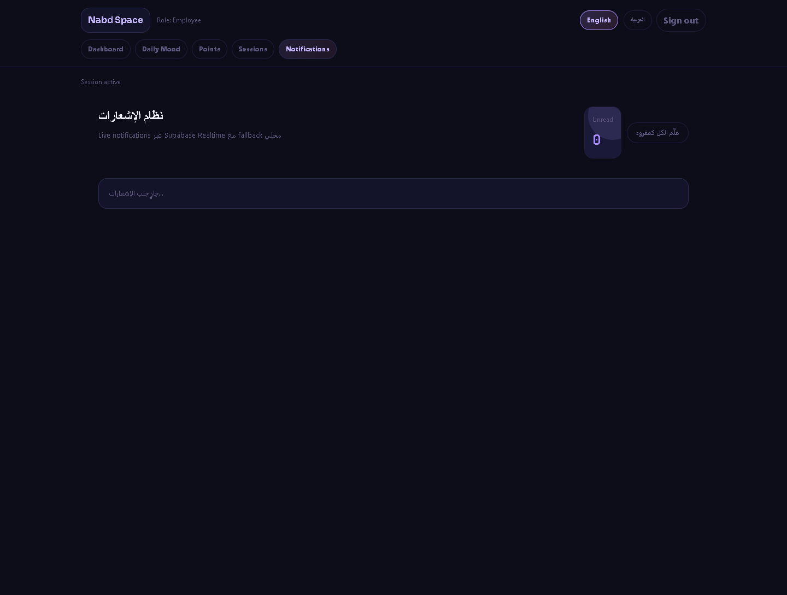

---

### 8. Admin Dashboard 👑
Admin KPI dashboard displaying:
- Daily participation rate
- Total points distributed
- Follow-up cases (critical alerts)
- Trend notes with quick insights

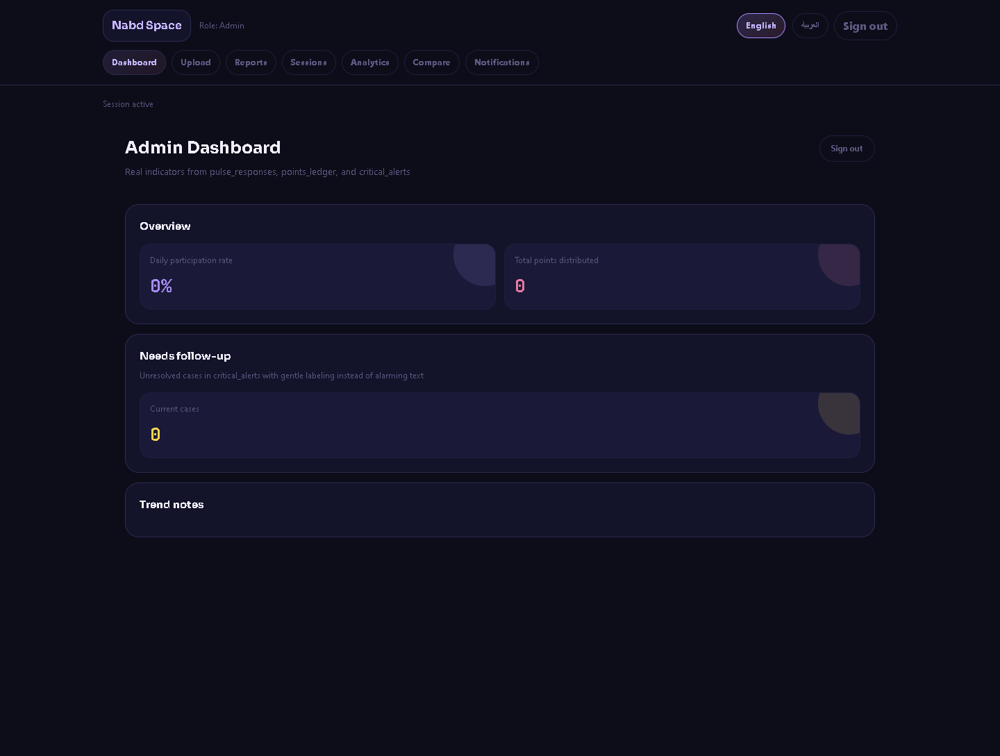

---

### 9. Reports 📊
Filterable reports (Weekly / Monthly / Yearly) with:
- Summary cards (employee count, average mood, follow-up cases)
- Department comparison table with status badges
- PDF and CSV export functionality

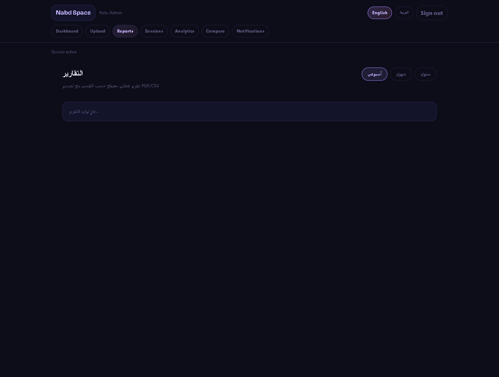

---

### 10. Analytics 📈
Data visualization dashboard with:
- **Line Chart**: 7-day mood trend
- **Bar Chart**: Department comparison scores
- **Pie Chart**: Department status distribution
- **Auto-classification**: Employee cards with status badges

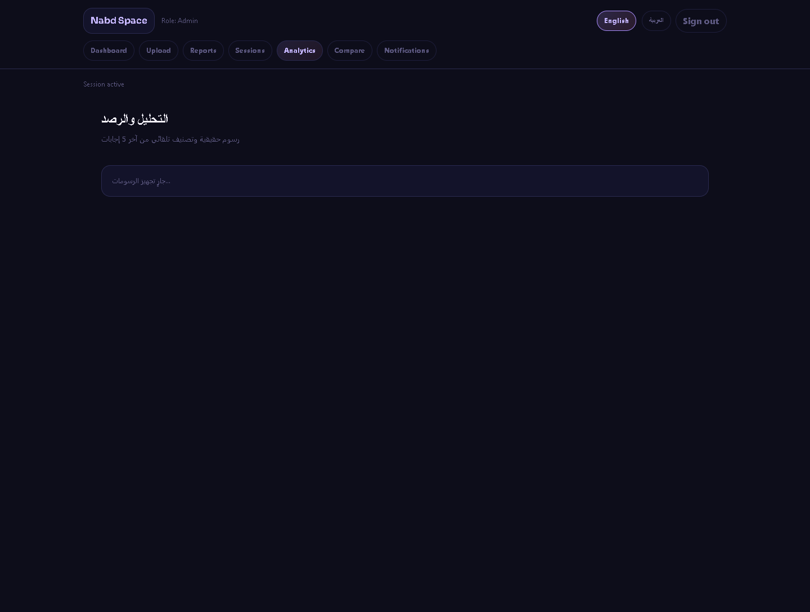

---

### 11. Analytics — Compare 📊
Secondary analytics page focused on department comparison and alternate data visualizations.

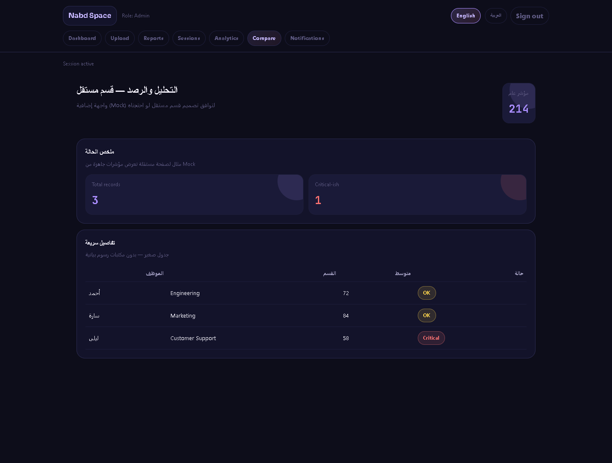

---

### 12. Upload Files 📁
Admin page for uploading employee CSV files. Supports bulk data import with processing status tracking.

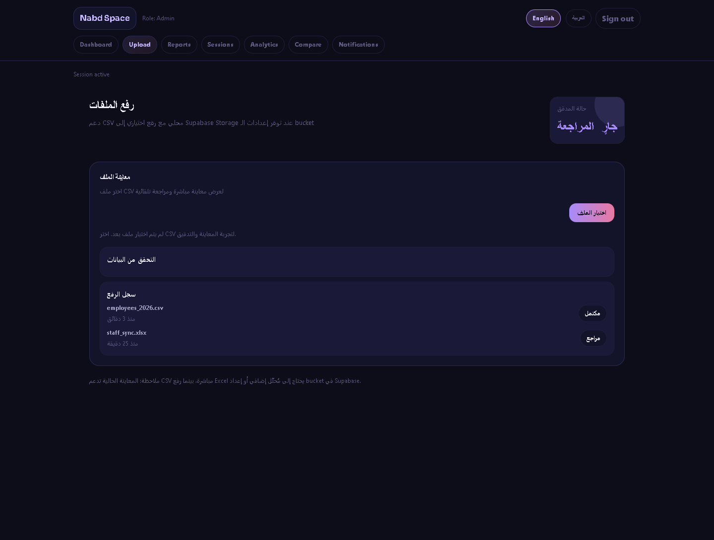

---

### 13. Signup Page 📝
New user registration page where employees and admins can create accounts.

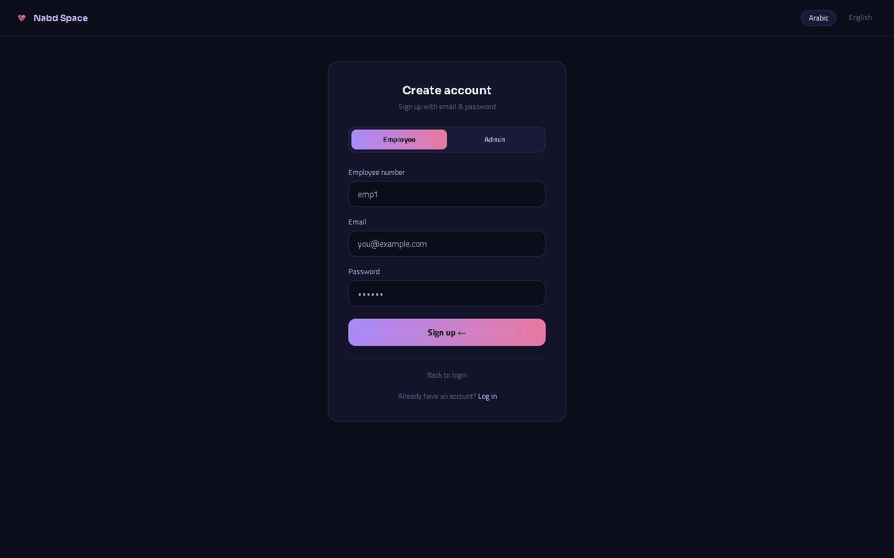

---

> 💡 **Note**: All screenshots were captured at 1440×900 viewport resolution. The dark theme with lavender/pink color palette is consistent across all pages.

---

## 🚀 How to Run the Project

### Prerequisites
- Node.js (v18 or later)
- npm or yarn

### 1. Local Development (No Backend Needed)
```bash
# 1. Navigate to project folder
cd nabd-hr-admin

# 2. Install dependencies
npm install

# 3. Start development server
npm run dev

# 4. Open browser
# http://localhost:5173
```

### 2. Demo Credentials
| Role | Username | Password |
|------|----------|----------|
| 👤 Employee | `emp1` | `1234` |
| 👑 Admin | `admin` | `1234` |

### 3. Run with Supabase (Optional — for real database)
```bash
# Create .env file
VITE_SUPABASE_URL=https://your-project.supabase.co
VITE_SUPABASE_ANON_KEY=your-anon-key

# Run the application
npm run dev
```

### 4. Production Build
```bash
npm run build
npm run preview
```

---

## 🔮 Future Work

| Area | Enhancement |
|------|-------------|
| **Integration** | Connect with Slack, Teams, Telegram for notifications |
| **Advanced Analytics** | AI-powered burnout prediction before it happens |
| **Custom Surveys** | Admin-created custom surveys & questionnaires |
| **Professional Reports** | PDF reports with embedded charts & branding |
| **Employee Management** | Add/Edit/Delete employees from admin panel |
| **Chat Support** | Real-time chat with HR/counselors |
| **Profile Management** | Avatar, bio, preferences |
| **Advanced Filters** | Filter analytics by department, role, date range |
| **Mobile App** | React Native companion app |
| **Periodic Assessment** | Monthly comprehensive well-being assessment |

---

## 👩‍💻 Team

| Member | Role |
|--------|------|
| **Student** | Bachelor of Information Technology — Systems Development & Administration |
| | Requirements Analysis |
| | Database Design |
| | Frontend Development |
| | Project Management & Documentation |

**Supervisor**: Dr. [Add Doctor's Name]

---

## 📁 Appendix: Full Folder Structure

```
nabd-hr-admin/
├── .gitignore
├── CLAUDE.md
├── eslint.config.js
├── index.html
├── package-lock.json
├── package.json
├── postcss.config.js
├── README-railway.md
├── README.md
├── tailwind.config.js
├── TODO.md
├── tsconfig.json
├── tsconfig.node.json
├── vite-env.d.ts
├── vite.config.d.ts
├── vite.config.js
├── vite.config.ts
│
├── src/
│   ├── App.tsx
│   ├── index.css
│   ├── main.tsx
│   │
│   ├── auth/
│   │   ├── BootContext.tsx
│   │   └── ProtectedRoute.tsx
│   │
│   ├── components/
│   │   ├── ui/
│   │   │   ├── Badge.tsx
│   │   │   ├── Button.tsx
│   │   │   ├── Card.tsx
│   │   │   ├── EmptyState.tsx
│   │   │   ├── index.ts
│   │   │   ├── Input.tsx
│   │   │   ├── Modal.tsx
│   │   │   ├── SkeletonLoader.tsx
│   │   │   ├── Textarea.tsx
│   │   │   └── Toast.tsx
│   │   ├── AdminUI.tsx
│   │   ├── AppShell.tsx
│   │   ├── DataState.tsx
│   │   ├── HeartLoader.tsx
│   │   └── LangToggle.tsx
│   │
│   ├── i18n/
│   │   ├── i18n.ts
│   │   └── LangContext.tsx
│   │
│   ├── lib/
│   │   ├── dashboardData.ts
│   │   └── supabaseClient.ts
│   │
│   ├── mock-data/
│   │   ├── admin.ts
│   │   ├── analytics.ts
│   │   ├── auth.ts
│   │   ├── employee.ts
│   │   ├── index.ts
│   │   ├── landing.ts
│   │   ├── mood.ts
│   │   ├── notifications.ts
│   │   ├── points.ts
│   │   ├── reports.ts
│   │   ├── sessions.ts
│   │   └── uploads.ts
│   │
│   ├── pages/
│   │   ├── AdminDashboard.tsx
│   │   ├── AnalyticsMonitoring.tsx
│   │   ├── AnalyticsMonitoring2.tsx
│   │   ├── EmployeeDashboard.tsx
│   │   ├── HeartLoaderPage.tsx
│   │   ├── Landing.tsx
│   │   ├── Login.tsx
│   │   ├── MoodQuestions.tsx
│   │   ├── NotificationSystem.tsx
│   │   ├── PointsRewards.tsx
│   │   ├── Reports.tsx
│   │   ├── SessionsCalendar.tsx
│   │   ├── Signup.tsx
│   │   └── UploadFiles.tsx
│   │
│   ├── styles/
│   │   └── fonts.css
│   │
│   └── theme/
│       └── tokens.ts
│
└── supabase/
    └── migrations/
        └── 001_init_hr_schema.sql
```

---

## ✅ Project Summary

**Nabd Space** is a comprehensive graduation project designed to improve employee mental health and well-being in workplace environments. The system features:

1. **Clean Architecture** — Clear separation of concerns (Presentation → Business Logic → Data)
2. **Immediate Usability** — Works out-of-the-box with built-in Mock Data, no Backend setup required
3. **Scalable Design** — Ready to connect with Supabase for production deployment
4. **Bilingual Support** — Full Arabic (RTL) and English (LTR) interface
5. **Modern UI/UX** — Elegant dark theme with calming lavender & pink color palette
6. **Enterprise Security** — Row Level Security (RLS) for complete data privacy
7. **Excellent User Experience** — Intuitive interface with animated Heart Loader

---

> 📅 **Presentation Date**: [Add Date]
> 
> 📧 **Contact**: [Add Email]
> 
> 🎓 **Under Supervision of Dr.**: [Add Doctor's Name]

